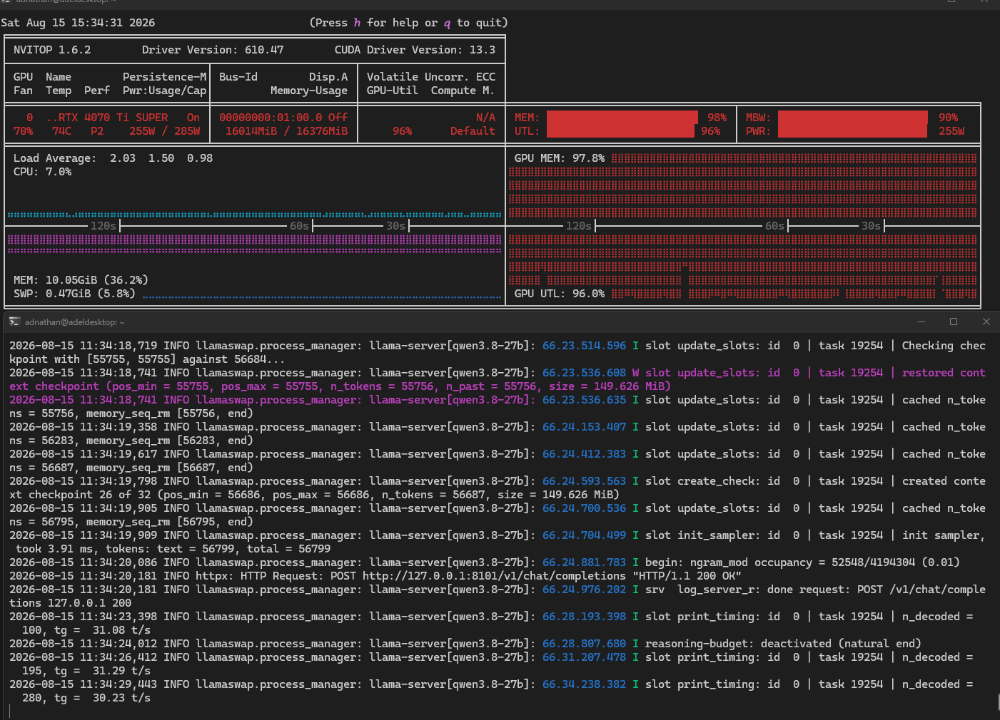

# LlamaSwap

An OpenAI-compatible proxy in front of `llama-server` (llama.cpp) with a
YAML-driven model registry. Point any OpenAI client at it and switch chat
models per request — the backend chat `llama-server` is stopped and
relaunched transparently with the launch command of the requested model.

A dedicated embedding `llama-server` runs persistently on its own port, so
`/v1/embeddings` does not disturb the currently loaded chat model.

The OpenAI **audio API** is served by per-role TTS/ASR servers
(`/v1/audio/speech`, `/v1/audio/transcriptions`) that can be switched
between backends per request — e.g. audio.cpp's Qwen3-ASR vs
whisper.cpp's whisper-server — without touching the loaded chat LLM.

**Only the embedding server is persistent.** The chat LLM and every
TTS/ASR server are on-demand: nothing boots until a request names them,
and each is stopped again after `LLAMASWAP_IDLE_UNLOAD_SECONDS` (default
300 s) with no requests — the same idle-unload policy everywhere.

## How it works

```
OpenAI client (port 11434)
        │  /v1/chat/completions, /v1/embeddings,
        │  /v1/audio/speech, /v1/audio/transcriptions, /v1/models
        ▼
llamaswap (FastAPI)
  • model registry        ← backend/*.yaml
  • LLM process manager   ← start / stop / swap chat llama-server (on-demand)
  • embedding manager     ← persistent embedding llama-server
  • audio managers        ← on-demand per-role TTS/ASR servers (t+r)
        │  HTTP (streaming pass-through / binary pass-through)
        ├── llama-server chat   (127.0.0.1:8101, on-demand + idle unload)
        ├── llama-server embed (127.0.0.1:8102, persistent)
        ├── audiocpp_server TTS (127.0.0.1:8103, on-demand, swappable)
        ├── audiocpp_server ASR (127.0.0.1:8104, on-demand, swappable)
        └── whisper-server ASR  (127.0.0.1:8105, on-demand, swappable)
```

- **One chat LLM at a time.** A 13 GB model does not fit twice on a 16 GB
  GPU, so when a request names a different chat model than the one currently
  loaded, the proxy gracefully stops the running chat `llama-server`, spawns
  a new one from that model's YAML config, and waits for its `/health`
  endpoint before forwarding the request.
- **Persistent embeddings.** If the registry contains a model with
  `role: embedding`, llamaswap launches it at startup and keeps it running
  for the lifetime of the proxy. `/v1/embeddings` goes directly to that
  server, leaving the loaded chat model untouched.
- **Resource fallback.** If a chat model fails to load while the embedding
  server is running, llamaswap stops the embedding server, retries the chat
  load once, and then best-effort relaunches embeddings in the background.
- **Registry.** Every file in `backend/` is one model: the exact
  binary + arguments + env + port. Add a file, reload, done. Works for any
  OpenAI-compatible backend, not just llama-server.
- **OpenAI compatible.** llama-server already speaks the OpenAI protocol; the
  proxy passes it through (SSE streams included) and rewrites response
  `model` fields to the model named in the request.
- **TTS / ASR with a switch.** A `role: tts` or `role: asr` model is
  on-demand: the first request of a role boots its server, a request
  naming a different audio model of the same role stops the running server
  and launches the requested one, and after `idle_unload_seconds` with no
  requests it is stopped again — e.g. `/v1/audio/transcriptions` with
  `model: "whisper-asr"` loads whisper.cpp, with `model: "qwen3-asr"`
  loads audio.cpp. Both appear in `/v1/models`; whichever is requested
  gets loaded.
- **Backend dialect translation.** whisper.cpp's whisper-server speaks the
  OpenAI multipart upload natively (`request_format: multipart`);
  audio.cpp's transcription endpoint takes a server-side file path
  (`request_format: json_path`), so llamaswap saves the uploaded audio and
  rewrites the request. Clients always talk plain OpenAI.

## Layout

```
llamaswap/
├── backend/                  # model registry — one YAML per model
│   ├── octen-embedding.yaml  # persistent embedding server
│   ├── qwen3.8-27b.yaml      # chat LLMs
│   ├── outetts-tts.yaml      # TTS: OuteTTS via audio.cpp (role: tts)
│   ├── qwen3-asr.yaml        # ASR: Qwen3-ASR via audio.cpp (role: asr)
│   └── whisper-asr.yaml      # ASR: Whisper via whisper.cpp (role: asr)
├── app/
│   ├── config.py             # settings (env prefix LLAMASWAP_)
│   ├── registry.py           # YAML → validated ModelConfig objects
│   ├── process_manager.py    # chat llama-server lifecycle + health checks
│   ├── embedding_manager.py  # persistent embedding llama-server lifecycle
│   ├── audio_manager.py      # on-demand per-role TTS/ASR lifecycle + swap + idle unload
│   ├── proxy.py              # async reverse proxy (stream / raw / multipart)
│   └── main.py               # FastAPI routes (OpenAI API)
├── requirements.txt
├── docs/images/              # screenshots referenced by this README
└── README.md
```

## Model config format

```yaml
name: qwen3.8-27b                    # model id used in API requests
description: "human readable"
role: llm                            # llm (default) or embedding
command:
  binary: /opt/llama.cpp/build/bin/llama-server
  args:
    - "--model"
    - "/opt/models/Qwen3.8-27B-UD-Q3_K_XL.gguf"
    - "--ctx-size"
    - "8192"
    - "--n-gpu-layers"
    - "99"
    - "--jinja"
  env:                               # optional, merged over os.environ
    CUDA_VISIBLE_DEVICES: "0"
host: 127.0.0.1                      # internal binding (enforced)
port: 8101                           # internal port (enforced)
meta:
  context_length: 8192
  family: qwen
  capabilities: [chat]
```

`role` can be:

| role | manager | swaps per request | example |
|---|---|---|---|
| `llm` | ProcessManager | yes | `qwen3.8-27b` |
| `embedding` | EmbeddingManager | no (single) | `octen-embedding-0.6b` |
| `tts` | AudioManager | yes (among tts models) | `outetts` |
| `asr` | AudioManager | yes (among asr models) | `whisper-asr`, `qwen3-asr` |

`role: llm` models are swapped on request by the normal path. A single
`role: embedding` model runs persistently on its own port (usually `8102`)
and should pass `--embedding` in `args`.

`role: tts` / `role: asr` models are on-demand per-role servers: nothing
boots with the proxy — the first request of a role launches its first
configured model, a request naming a different audio model of the same
role swaps the server (`/v1/audio/speech` → the `tts` role;
`/v1/audio/transcriptions` → the `asr` role), and the server is stopped
after `LLAMASWAP_IDLE_UNLOAD_SECONDS` with no requests (same policy as
the chat LLM). Each audio model needs its own port (`8103`+ recommended).

`meta.request_format` tells the proxy which request dialect the backend
speaks (default `json`):

- `json` — JSON body in, JSON/audio out (llama-server, audio.cpp speech)
- `multipart` — OpenAI multipart uploads pass through (whisper.cpp)
- `json_path` — JSON body takes a server-side file path; the proxy saves
  the uploaded audio to `LLAMASWAP_AUDIO_TMP_DIR` and rewrites the request
  (audio.cpp `/v1/audio/transcriptions`)

`command.config_json` (optional) is rendered to a temp file at launch for
structured-config backends (audio.cpp). Placeholders `{host}`, `{port}`,
`{name}`, `{config_path}` are substituted, and `host`/`port` always follow
the enforced YAML values — ready-to-use audio.cpp server configs, no
hand-written JSON files needed.

`host`/`port` are always enforced by the proxy (any `--host`/`--port` in
`args` is stripped, and audio.cpp configs are rewritten) so models never
fight over the internal port.

# Installation
## LLMs download

```bash
mkdir -p /opt/models
hf download hf://unsloth/Qwen3.8-27B-GGUF/Qwen3.8-27B-UD-Q3_K_XL.gguf --local-dir /opt/models
hf download hf://unsloth/Qwen3.6-35B-A3B-GGUF/Qwen3.6-35B-A3B-UD-IQ3_XXS.gguf --local-dir /opt/models
```

### Getting and compiling llama.cpp

llamaswap does not bundle llama.cpp — each model YAML in `backend/` points at
a `llama-server` binary you compile (or install) yourself. The default
configs expect it at `/opt/llama.cpp/build/bin/llama-server`.

Prerequisites for both backends: git, cmake (≥ 3.13) and a C++17 compiler
(`g++`/`clang++`).

### CUDA (NVIDIA)

Install the [CUDA Toolkit](https://developer.nvidia.com/cuda-downloads)
(`nvcc`) and your GPU driver, then:

```bash
mkdir -p /opt/llamacpp
cd /opt/llamacpp
git clone https://github.com/ggml-org/llama.cpp
cd llama.cpp
cmake -B build -DCMAKE_BUILD_TYPE=Release -DGGML_CUDA=ON
cmake --build build --config Release -j
```

### ROCm (AMD)

Install [ROCm](https://rocm.docs.amd.com/) (`hipcc`) and your GPU driver,
then:
```bash
git clone https://github.com/ggml-org/llama.cpp
cd llama.cpp
cmake -B build -DCMAKE_BUILD_TYPE=Release -DGGML_HIPBLAS=ON
cmake --build build --config Release -j
```

### Embedding model tensores download amd GGUF convert
```bash
hf download Octen/Octen-Embedding-0.6B --local-dir /opt/models/Octen-Embedding-0.6B

python3 /opt/llama.cpp/convert_hf_to_gguf.py \
  /opt/models/Octen-Embedding-0.6B \
  --outtype q8_0 \
  --outfile /opt/models/Octen-Embedding-0.6B-Q8_0.gguf
```

### Building audio.cpp (TTS + ASR)

The `outetts-tts.yaml` and `qwen3-asr.yaml` configs point at audio.cpp's
`audiocpp_server` (a single native ggml binary for TTS/ASR — think
llama-server, but for audio). The project lives at
`https://github.com/0xShug0/audio.cpp` (release `v0.7.0`).

**Prerequisites**

* NVIDIA GPU with Compute Capability ≥ 7.5 (Turing / RTX 20-series or
  newer) + current NVIDIA driver; verify with `nvidia-smi`.
* [CUDA Toolkit](https://developer.nvidia.com/cuda-downloads) (`nvcc`) —
  required to compile the ggml CUDA kernels (`ENGINE_ENABLE_CUDA=ON`);
  verify with `nvcc --version`. The same toolkit as for llama.cpp works.
* CMake ≥ 3.24 (older versions lack the `native` CUDA-arch fallback that
  audio.cpp's build uses).
* A C++20 compiler: `g++-13` or newer (or `clang++-17+`).
* `git` + `curl` (audio.cpp pulls its submodules from GitHub).
* ~10 GB free disk space for clone + CUDA build artifacts.
* ~16 GB RAM (CUDA compilation is memory-hungry; 32 GB is comfortable).

```bash
mkdir -p /opt/audio.cpp
cd /opt/audio.cpp
git clone --depth 1 --branch v0.7.0 https://github.com/0xShug0/audio.cpp .
git submodule update --init --recursive
# Only the outetts (TTS) + qwen3_asr (ASR) models are compiled in, which
# keeps the build time and binary small. Drop AUDIOCPP_MODEL_SET /
# AUDIOCPP_MODELS to build the full model set instead.
cmake -S . -B build -DCMAKE_BUILD_TYPE=Release -DENGINE_ENABLE_CUDA=ON \
    -DAUDIOCPP_MODEL_SET=custom -DAUDIOCPP_MODELS="outetts,qwen3_asr,supertonic,nemotron_asr"
# Cap at 70% of available cores so nvcc does not saturate the host
# (28 threads -> -j19; 20 cores -> -j14).
cmake --build build --parallel $(($(nproc) * 7 / 10)) --target audiocpp_server
```

> The custom model set above only compiles the `outetts` + `qwen3_asr` + `supertonic` + `nemotron_asr`
> loaders (small binary, fast build). To use the higher-quality families
> below (Higgs Audio, IndexTTS, VibeVoice, VoxCPM2, Nemotron/Parakeet ASR,
> ...), build with the **full model set** instead — drop the
> `AUDIOCPP_MODEL_SET` / `AUDIOCPP_MODELS` flags entirely (larger binary,
> ~2-3x longer compile):
>
> ```bash
> cmake -S . -B build -DCMAKE_BUILD_TYPE=Release -DENGINE_ENABLE_CUDA=ON \
>     -DAUDIOCPP_DEPLOYMENT_BUILD=ON
> cmake --build build --parallel $(($(nproc) * 9 / 10)) --target audiocpp_server
> ```

### Voice quality: recommended model families

audio.cpp (v0.7.0) ships **62 model families / 85+ variants**. Which one
sounds best is subjective, but these are the strongest voices per the
project's own model catalog. TTS families support the same GGUF loading
path and the llamaswap YAML wiring (
`family:` + `path:` in `command.config_json.models[]`); ASR families work
the same way through `request_format: json_path`.

**TTS — top naturalness / expressiveness (larger, needs VRAM):**

| Family | Model | Notes |
|---|---|---|
| `higgs_audio_tts` | Higgs Audio v3 TTS 4B | Flagship TTS+clone+control; best overall naturalness |
| `voxcpm2` | VoxCPM2-2B | 48 kHz output, Clone/Design/Ctrl, multilingual |
| `vibevoice` | VibeVoice 1.5B / 7B | Dialogue-grade expressive TTS (en, zh) |
| `index_tts2` | IndexTTS-2 / 2.5 | Strong clone + style control (zh,en,ja,es,ar) |
| `fish_audio` | Fish Audio S2 Pro | auto/en/zh, Clone + Ctrl |
| `fireredtts3` | FireRedTTS3 Base/Instruct | 24 langs + 21 zh dialects, Designs voices |

**TTS — best quality per GB / small-footprint (VRAM-friendly):**

| Family | Model | Notes |
|---|---|---|
| `qwen3_tts` | Qwen3-TTS 1.7B Base/CustomVoice | Best size/quality ratio; Clone + Design variants (script: `tts-qwen3`) |
| `omnivoice` | OmniVoice (Qwen3-0.6B) | 646+ languages, Clone/Design/Ctrl |
| `magpie_tts` | NVIDIA MagpieTTS 357M | Tiny, crisp, multilingual (12 langs) |
| `supertonic` | Supertonic 3 | Very fast (200x+ real-time on CUDA), en + 31 langs |
| `miotts` | MioTTS-1.7B | Clean en/ja voice, Clone |
| `neutts` | NeuTTS 2E | Emotion control, streaming |
| `pocket_tts` | PocketTTS-100M | Tiniest TTS that still sounds good (en,de,it,pt,es) |
| `outetts` | OuteTTS 1.0 1B | Current default (script: `tts`); community port, Clone |

**TTS — community ports (also very high quality):** `glm_tts` (GLM-TTS,
zh/en clone), `f5_tts` (F5-TTS flow-matching DiT, en/ar), `vietneu_tts`
(VieNeu-TTS v3, vi/en), `dots_tts` (DotTTS SOAR, multilingual Edit/Ctrl).

**ASR — highest accuracy:** `voxtral_realtime` (Voxtral-Mini-4B-Realtime,
state-of-the-art but 4B), `nemotron_asr` (Nemotron 3.5 ASR Streaming 0.6B,
100+ languages, streaming), community `parakeet_tdt` (NVIDIA Parakeet-TDT
0.6B, offline + streaming), `fun_asr_nano` (Fun-ASR-Nano-2512). The
current default `qwen3_asr` (script: `asr`) remains the best accuracy/speed
trade-off for zh/en.

> **Kokoro note** (from the audio.cpp catalog): `kokoro_tts` is listed as
> "integration" only — no loader is wired into the runtime, so it cannot
> load Kokoro GGUFs today. Use a supported family above instead.

> **VRAM:** the flagship families (4B Higgs Audio, Voxtral 4B) need several
> GB on top of the chat model. Load a smaller chat model (e.g.
> `qwen3.5-9b`) alongside them, or swap chat models per request — llamaswap
> keeps only the requested model loaded per role.

> **Model downloads:** `download-models.sh` only covers the default bundles
> (`tts`, `asr`, `whisper`, `tts-qwen3`). For any other family use audio.cpp's
> model manager `audiocpp_model_manager install <package>` (see
> [audio.cpp README](https://github.com/0xShug0/audio.cpp)) or grab the GGUF
> from [audio-cpp/audio.cpp-gguf](https://huggingface.co/audio-cpp/audio.cpp-gguf)
> into `/opt/models`, then add a `backend/<family>.yaml` mirroring
> `outetts-tts.yaml` with the matching `family:` + `path:`.

```bash
# Models (downloads the missing weights into /opt/models):
#   TTS: OuteTTS 1.0 1B Q8_0 GGUF (family `outetts`)
#   ASR: Qwen3-ASR 0.6B Q8_0 GGUF (family `qwen3_asr`)
./scripts/download-models.sh tts asr
```

The binary ends up at `build/bin/audiocpp_server`. The Docker overlay
(below) stamps this host-built binary into the image — nothing is compiled
inside the build.

### Building whisper.cpp (ASR)

The `whisper-asr.yaml` config points at whisper.cpp's `whisper-server`
(OpenAI multipart dialect, `--inference-path` remapped to
`/v1/audio/transcriptions`).

**Prerequisites**

* NVIDIA GPU + driver and the [CUDA Toolkit](https://developer.nvidia.com/cuda-downloads)
  (`nvcc`) — required for `GGML_CUDA=ON`; the same toolkit as llama.cpp/
  audio.cpp works.
* CMake ≥ 3.24 and a C++17 compiler (`build-essential`/`g++`) — same
  toolchain as the llama.cpp build above.
* `git` — to clone whisper.cpp.
* `ffmpeg` — only needed to convert audio with `whisper-cli --convert`;
  NOT required to run `whisper-server` (llamaswap's proxy pre-converts
  uploads to wav and hands the server a file path).
* ~5 GB free disk space for clone + CUDA build artifacts.

```bash
mkdir -p /opt/whisper.cpp
cd /opt/whisper.cpp
git clone https://github.com/ggml-org/whisper.cpp .
# GGML_CUDA is the current CUDA flag (WHISPER_CUBLAS is a deprecated alias).
cmake -B build -DCMAKE_BUILD_TYPE=Release -DGGML_CUDA=ON
# Cap at 70% of available cores so nvcc does not saturate the host.
cmake --build build --config Release --target whisper-server \
    --parallel $(($(nproc) * 9 / 10))

# model (any size; configs use base.en)
./scripts/download-models.sh whisper
```

The binary ends up at `build/bin/whisper-server`. The Docker overlay
(below) stamps this host-built binary into the image — nothing is compiled
inside the build. `--convert` needs `ffmpeg` (only for local conversion;
llamaswap's proxy pre-converts uploads to wav itself).

### Enabling TTS/ASR in Docker (optional overlay)

The base image stays buildable without any audio backends. The
`Dockerfile.audio` overlay does **not** compile anything — audio.cpp and
whisper.cpp are built on the **host** (`/opt/audio.cpp/build/bin`,
`/opt/whisper.cpp/build/bin`; see the two build sections above) and the
overlay simply *stamps* those binaries into the image via build contexts,
exactly like llama.cpp (`llamacpp-bin`). The overlay also adds a
`models-init` one-shot service that downloads the missing model weights
into the shared `/opt/models` directory before llamaswap starts:

```bash
# 1. build the base image first (any llamaswap:local build works)
docker compose up --build
# 2. build + start with the audio stack (host-built binaries stamped in,
#    models downloaded into /opt/models, then llamaswap starts)
docker compose -f docker-compose.yml -f docker-compose.audio.yml up -d --build
```

If you rebuild the binaries and want llamaswap to pick them up, just rerun
step 2 (`up -d --build`) — the copy layer rebuilds because the context
changed. From then on, use the two-file invocation (or replace it with a
`COMPOSE_FILE` env: `docker-compose.yml:docker-compose.audio.yml`).

To fetch the models without going through compose, run the same script on
the host:

```bash
./scripts/download-models.sh          # tts asr whisper
./scripts/download-models.sh tts-qwen3  # optional: Qwen3-TTS 0.6B backend
```

Without the overlay the audio YAMLs in `backend/` simply fail to spawn
their (missing) binaries — the proxy keeps running and reports the roles
as stopped in `/health`. Delete the audio YAMLs to hide them from
`/v1/models` entirely.

### LlamaSwap Docker Instllation
```bash
cd ~
git clone https://github.com/AdelNazmy/llamaswap.git
cd llamaswap
docker compose up --build
```
Notes:

- The binary ends up at `build/bin/llama-server`; either run llama.cpp from
  its clone location or move it and update `binary:` in the model YAMLs.
- Verify the GPU backend before pointing llamaswap at it — the server logs
  `CUDA is initialized` (or the ROCm equivalent) on startup. The proxy
  mirrors those lines into its own log, so a missing/wrong backend shows up
  there as `llama-server[<model>]: ...`.
- The Docker image in this repo ships a prebuilt CUDA `llama-server`
  instead, so the steps above are only for building it locally.

## Local Run
### Install Prerequisites
```bash
cd ~
pip install uv
uv venv .venv -p3.12 --seed
source .venv/bin/activate
uv pip install -r ~/llamaswap/requirements.txt
```

### Launch Application
```bash
cd ~/llamaswap
~/.venv/bin/uvicorn app.main:app --host 0.0.0.0 --port 11434
```

Or with an explicit python:

```bash
~/.venv/bin/python -m uvicorn app.main:app --host 0.0.0.0 --port 11434
```

Environment overrides (prefix `LLAMASWAP_`): `LLAMASWAP_PORT`,
`LLAMASWAP_BACKEND_DIR`, `LLAMASWAP_STARTUP_TIMEOUT`,
`LLAMASWAP_STOP_TIMEOUT`, `LLAMASWAP_LOG_LEVEL`.

## API

| Endpoint | Description |
|---|---|
| `GET /v1/models` | List models from the registry (OpenAI shape) |
| `GET /v1/models/{model}` | One model entry |
| `POST /v1/chat/completions` | Chat; `stream: true` for SSE |
| `POST /v1/completions` | Text completions |
| `POST /v1/embeddings` | Embeddings; uses the persistent embedding server if configured, otherwise the normal model-swap path |
| `POST /v1/audio/speech` | TTS (`role: tts`); JSON in, binary audio out (wav/mp3 depending on backend) |
| `POST /v1/audio/speech/stream` | TTS streaming variant (if the backend exposes one) |
| `POST /v1/audio/transcriptions` | ASR (`role: asr`); OpenAI multipart upload → `{"text": ...}` |
| `POST /v1/audio/translations` | ASR translate-to-English (whisper.cpp supports via a `translate` form field; others pass through) |
| `GET /v1/audio/voices` | List TTS voices (pass-through to the tts backend) |
| `POST /v1/registry/reload` | Re-read `backend/*.yaml` (admin) |
| `GET /health` | Proxy, current chat llama-server, embedding, and TTS/ASR status (audio/chat report `idle_seconds` while loaded) |

### Examples

```bash
# list models
curl -s localhost:11434/v1/models | jq

# chat (non-streaming) — first call loads the model (can take minutes)
curl -s localhost:11434/v1/chat/completions -d '{
  "model": "qwen3.8-27b",
  "messages": [{"role": "user", "content": "Say hello in one word."}],
  "max_tokens": 32
}'

# streaming
curl -N localhost:11434/v1/chat/completions -d '{
  "model": "qwen3.8-27b",
  "messages": [{"role": "user", "content": "Count to five."}],
  "stream": true
}'

# switch model — the proxy swaps the backend for you
curl -s localhost:11434/v1/chat/completions -d '{
  "model": "qwen3.6-35b",
  "messages": [{"role": "user", "content": "Who are you?"}],
  "max_tokens": 64
}'

# vision
curl -s localhost:11434/v1/chat/completions -d '{
  "model": "qwen3.6-35b-vision",
  "messages": [{"role": "user", "content": [
    {"type": "text", "text": "What do you see?"},
    {"type": "image_url", "image_url": {"url": "http://.../cat.jpg"}}
  ]}]
}'

# embeddings — served by the persistent embedding server
curl -s localhost:11434/v1/embeddings -d '{
  "model": "octen-embedding-0.6b",
  "input": "hello world"
}'

# TTS — boots on first use, then idle-unloads like the chat LLM (audio.cpp / outetts)
curl -s localhost:11434/v1/audio/speech \
  -H 'Content-Type: application/json' \
  -d '{"model": "outetts", "input": "Hello from llamaswap!", "voice": "af_sky"}' \
  -o out.wav

# ASR — multipart upload; the `model` field picks the ASR backend and
# llamaswap swaps it in transparently (whisper.cpp vs audio.cpp qwen3-asr)
curl -s localhost:11434/v1/audio/transcriptions \
  -F 'model=whisper-asr' -F 'file=@speech.wav' -F 'response_format=json'

# same upload, different backend — llamaswap stops whisper-server and
# starts audio.cpp qwen3-asr, then forwards the file internally
curl -s localhost:11434/v1/audio/transcriptions \
  -F 'model=qwen3-asr' -F 'file=@speech.wav'
```

OpenAI SDK:

```python
from openai import OpenAI
client = OpenAI(base_url="http://localhost:11434/v1", api_key="unused")
resp = client.chat.completions.create(
    model="qwen3.8-27b",
    messages=[{"role": "user", "content": "Hello!"}],
)
print(resp.choices[0].message.content)

emb = client.embeddings.create(
    model="octen-embedding-0.6b",
    input="hello world",
)
print(emb.data[0].embedding[:8])

# TTS
with client.audio.speech.with_streaming_response.create(
    model="outetts", voice="af_sky", input="Hello from llamaswap",
) as resp:
    resp.stream_to_file("out.wav")

# ASR — swap backends per request via the `model` field
with open("speech.wav", "rb") as fh:
    tr = client.audio.transcriptions.create(
        model="whisper-asr", file=fh, response_format="json",
    )
    print(tr.text)
```

## Notes

- The persistent embedding server starts with the proxy. If it fails to
  start, the proxy still starts and reports the embedding state in
  `/health`. The chat LLM and TTS/ASR servers start on first use instead
  of booting with the proxy.
- The chat LLM and TTS/ASR servers are stopped after
  `LLAMASWAP_IDLE_UNLOAD_SECONDS` with no requests (`/health` shows
  `idle_seconds`); only the embedding server stays up. Switching between
  audio backends of the same role (e.g. `whisper-asr` ↔ `qwen3-asr`)
  stops the previous audio server and starts the requested one — a few
  seconds.
- `/v1/audio/speech` returns whatever the backend returns (audio.cpp
  returns WAV; Kokoro-FastAPI would return mp3 — the proxy passes the
  `Content-Type` through).
- Whisper.cpp's whisper-server needs `ffmpeg` for `--convert` (ships in the
  Docker image). The first ASR request after boot loads the model.
- Chat model first request loads it (13 GB → VRAM); expect 1–3 minutes.
  Subsequent requests for the *same* model are instant.
- Switching back and forth re-loads the model each time (that is the
  price of one-model-at-a-time on 16 GB VRAM).
- If a chat model cannot load while embeddings are running, the embedding
  server is stopped and the chat load is retried once. If the retry
  succeeds, embeddings are relaunched in the background; if it fails, the
  error is returned and embeddings remain stopped until a later successful
  chat load or an embedding request restarts them.
- Model load failures are surfaced as `503` with the last llama-server
  log lines in the server console; the proxy stays up.
- `llama-server` stderr is mirrored to the proxy log as
  `llama-server[<model>]: ...`; embedding server lines are tagged
  `llama-server[embed <model>]: ...`.

## Utilization and logs
  
