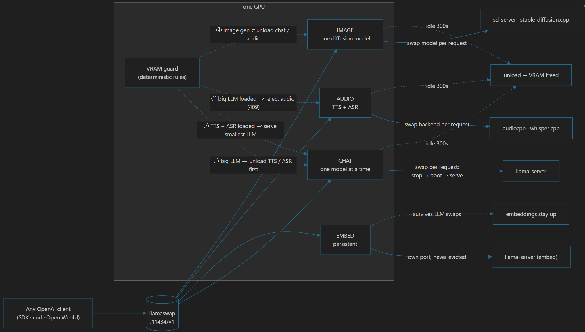
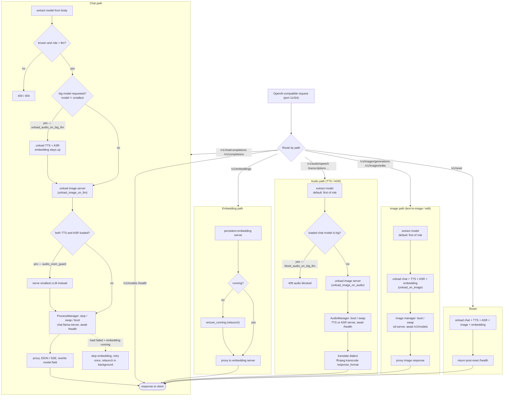

# LlamaSwap

An OpenAI-compatible proxy in front of `llama-server` (llama.cpp) with a
YAML-driven model registry. Point any OpenAI client at it and switch chat
models per request — the backend chat `llama-server` is stopped and
relaunched transparently with the launch command of the requested model.

A dedicated embedding `llama-server` runs persistently on its own port, so
`/v1/embeddings` does not disturb the currently loaded chat model.

The OpenAI **audio API** is served by per-role TTS/ASR servers
(`/v1/audio/speech`, `/v1/audio/transcriptions`) that can be switched
between backends per request — e.g. audio.cpp's Qwen3-ASR vs
whisper.cpp's whisper-server — without touching the loaded chat LLM.

**Only the embedding server is persistent.** The chat LLM and every
TTS/ASR server are on-demand: nothing boots until a request names them,
and each is stopped again after `LLAMASWAP_IDLE_UNLOAD_SECONDS` (default
300 s) with no requests — the same idle-unload policy everywhere.

A three-part VRAM policy keeps the GPU from being oversubscribed:
requesting a "big" chat LLM (any model larger than the smallest) unloads
the running TTS/ASR servers first — the embedding server stays up — so the
big model fits; while both TTS and ASR are loaded, chat is served by the
smallest LLM; and while a big chat LLM is loaded, TTS/ASR requests are
rejected with `409` (see `LLAMASWAP_UNLOAD_AUDIO_ON_BIG_LLM`,
`LLAMASWAP_AUDIO_VRAM_GUARD`, `LLAMASWAP_BLOCK_AUDIO_ON_BIG_LLM`).

## How it works

```
OpenAI client (port 11434)
        │  /v1/chat/completions, /v1/embeddings,
        │  /v1/audio/speech, /v1/audio/transcriptions,
        │  /v1/images/generations, /v1/images/edits, /v1/models
        ▼
llamaswap (FastAPI)
  • model registry        ← backend/*.yaml
  • LLM process manager   ← start / stop / swap chat llama-server (on-demand)
  • embedding manager     ← persistent embedding llama-server
  • audio managers        ← on-demand per-role TTS/ASR servers (t+r)
  • image manager         ← on-demand per-role image server
        │  HTTP (streaming pass-through / binary pass-through)
        ├── llama-server chat   (127.0.0.1:8101, on-demand + idle unload)
        ├── llama-server embed (127.0.0.1:8102, persistent)
        ├── audiocpp_server TTS (127.0.0.1:8103, on-demand, swappable)
        ├── audiocpp_server ASR (127.0.0.1:8104, on-demand, swappable)
        ├── whisper-server ASR  (127.0.0.1:8105, on-demand, swappable)
        └── sd-server image     (127.0.0.1:8109, on-demand, swappable)
```
## The flow, simplified

Read it left to right:

1. **One door, one dialect.** Any OpenAI client talks to `:11434/v1` — chat,
   embeddings, audio, images, models — nothing else changes.
2. **CHAT** = single `llama-server`. A request for a *different* model stops
   the running one, boots the new one from its YAML, waits for `/health`,
   then serves. A 13 GB model never needs to fit twice.
3. **EMBED** = its own persistent process on its own port, so embeddings
   never disturb — and are never evicted by — the loaded chat model.
4. **AUDIO** = per-role TTS and ASR servers that boot on first use and swap
   backends per request (Qwen3-ASR ↔ whisper.cpp; OuteTTS ↔ Supertonic ↔
   Qwen3-TTS voice clone). Ollama has none of this natively.
5. **IMAGE** = one on-demand diffusion server (stable-diffusion.cpp's
   `sd-server`) behind `/v1/images/generations` and `/v1/images/edits`. It
   swaps image models per request and idle-unloads like everything else.
6. **VRAM guard** — a set of deterministic rules (below) instead of hoping
   the GPU evicts the right thing.

### The VRAM guard — complete behavior
**One invariant drives everything, Heaviness decides who loses.**
>The image
server (FLUX ≈ 12 GB) is the heaviest tenant — it evicts whoever is
resident when *it* loads, and it is evicted by every *other* request. A
"big" chat LLM (anything larger than the smallest weights file, ≈ 7–13 GB)
evicts audio but is never evicted *by* audio — audio is simply refused
(`409`) while a big LLM holds the GPU. The embedding server (≈ 0.7 GB) is
the most persistent: it survives chat/audio swaps and only yields to the
image server (or a failed big-LLM load).

#### The four residents

| Tenant | Manager | Lifetime |
|---|---|---|
| Embedding | `EmbeddingManager` | persistent — boots at startup, survives all but image load / LLM retry |
| Chat LLM | `ProcessManager` | on-demand, one at a time, idle-unloaded |
| TTS / ASR | `RoleServerManager` ×2 | on-demand per role, idle-unloaded |
| Image | `RoleServerManager` ×1 | on-demand, idle-unloaded |

`LLAMASWAP_IDLE_UNLOAD_SECONDS` (default **300**) is the baseline: except
embedding, every loaded server is shut down after that many seconds with no
requests (`0` disables idle unload).

#### Rules by request type

**Chat** (`/v1/chat/completions`, `/v1/completions`) — in order:

1. Big LLM requested → stop TTS/ASR first (embedding stays up).
   `unload_audio_on_big_llm` (true)
2. Always unload the image server first (no-op if not loaded).
   `unload_image_on_llm` (true)
3. If TTS *and* ASR are both still resident → serve the smallest LLM
   instead of the requested one. `audio_vram_guard` (true)
4. Load the requested (or substituted) LLM. On load failure while embedding
   is running: stop embedding, retry once, then best-effort relaunch
   embedding in the background.

> The `audio_vram_guard` downgrade only fires when audio was *not* evicted —
> i.e. `unload_audio_on_big_llm=false` keeps audio resident, or the smallest
> LLM was requested while both audio roles hold VRAM. With the defaults, a
> big LLM evicts audio at step 1 and is never downgraded.

**Audio** (`/v1/audio/speech`, `/v1/audio/transcriptions`,
`/v1/audio/translations`) — in order:

1. Reject `409` if a big LLM is loaded or mid-load.
   `block_audio_on_big_llm` (true)
2. Unload the image server first (no-op if not loaded).
   `unload_image_on_audio` (true)
3. Load/swap the requested audio role.

This is the only path that returns `409` — and only against a big chat LLM,
never against the image server.

**Image** (`/v1/images/generations`, `/v1/images/edits`):

1. Stop chat LLM + TTS/ASR + embedding — free the whole GPU.
   `unload_on_image` (true)
2. Load/swap the image server.

**Embedding** (`/v1/embeddings`): served directly by the dedicated server,
never disturbs anything; if it was evicted it self-heals via
`ensure_running()`.

#### The six toggles

| Setting | Default | Meaning |
|---|---|---|
| `unload_audio_on_big_llm` | `true` | big LLM request → evict TTS/ASR first |
| `audio_vram_guard` | `true` | TTS + ASR both loaded → serve smallest LLM only |
| `block_audio_on_big_llm` | `true` | big LLM loaded → audio gets `409` |
| `unload_on_image` | `true` | image load → evict chat + audio + embedding |
| `unload_image_on_llm` | `true` | chat request → evict image |
| `unload_image_on_audio` | `true` | audio request → evict image |

#### Embedding server — the special case

The embedding server boots with the proxy and is **never** idle-unloaded. It
is evicted in exactly two cases — an image request frees the whole GPU, and
a big-LLM load fails and needs the VRAM for a retry — and it self-heals on
the next `/v1/embeddings` request (directly) or the next chat request
(background relaunch).

#### Worked examples

- **FLUX after chat:** a resident ~13 GB chat LLM is stopped, plus embedding;
  FLUX q8 (~12 GB) loads with its text encoders on CPU.
- **Chat right after FLUX:** the FLUX server is unloaded, the LLM loads, and
  embedding restarts in the background.
- **TTS right after FLUX:** the FLUX server is unloaded, then TTS boots — no
  `409`.
- **Both audio roles loaded, then a big LLM:** default = audio evicted, the
  big LLM loads. With `unload_audio_on_big_llm=false`, the request is instead
  downgraded to the smallest LLM.
- **Big LLM loaded, then audio:** audio is refused with `409`. With
  `block_audio_on_big_llm=false`, audio is allowed to stack and risks OOM.

No OOM roulette, no hidden GPU-driver eviction: every resident backend is
either supported by an explicit rule, evicted by an explicit rule, or
refused with `409`.

## The flow detailed
- **One chat LLM at a time.** A 13 GB model does not fit twice on a 16 GB
  GPU, so when a request names a different chat model than the one currently
  loaded, the proxy gracefully stops the running chat `llama-server`, spawns
  a new one from that model's YAML config, and waits for its `/health`
  endpoint before forwarding the request.
- **Persistent embeddings.** If the registry contains a model with
  `role: embedding`, llamaswap launches it at startup and keeps it running
  for the lifetime of the proxy. `/v1/embeddings` goes directly to that
  server, leaving the loaded chat model untouched.
- **Resource fallback.** If a chat model fails to load while the embedding
  server is running, llamaswap stops the embedding server, retries the chat
  load once, and then best-effort relaunches embeddings in the background.
- **VRAM policy (unload on big request).** When a request names a "big"
  chat LLM (any model other than the smallest by weights-file size),
  llamaswap stops the running TTS/ASR servers first to free VRAM — the
  embedding server stays up — then loads the big model. Controlled by
  `LLAMASWAP_UNLOAD_AUDIO_ON_BIG_LLM` (default true).
- **VRAM guard (chat direction).** While tts AND asr servers are both
  loaded, only the smallest chat LLM (smallest weights file on disk) is
  served — a request for a bigger chat model transparently loads the
  smallest one instead. (By default the unload rule above frees the audio
  first, so this downgrade mainly applies when
  `LLAMASWAP_UNLOAD_AUDIO_ON_BIG_LLM=false`.) Controlled by
  `LLAMASWAP_AUDIO_VRAM_GUARD` (default true).
- **VRAM guard (audio direction).** While a "big" chat LLM (any model
  other than the smallest by weights-file size) is loaded — or mid-load —
  `/v1/audio/*` requests are rejected with `409` so TTS/ASR cannot stack
  on top of a large model. Audio works again once the big LLM idle-unloads
  or the smallest model is served. Controlled by
  `LLAMASWAP_BLOCK_AUDIO_ON_BIG_LLM` (default true).
- **VRAM guard (image direction).** Image generation is the heaviest
  tenant: a `/v1/images/*` request stops the chat LLM, TTS/ASR, and
  embedding servers first to free the whole GPU; and any chat or TTS/ASR
  request stops the image server instead of stacking on it. Controlled by
  `LLAMASWAP_UNLOAD_ON_IMAGE`, `LLAMASWAP_UNLOAD_IMAGE_ON_LLM`, and
  `LLAMASWAP_UNLOAD_IMAGE_ON_AUDIO` (all default true).
- **Registry.** Every file in `backend/` is one model: the exact
  binary + arguments + env + port. Add a file, reload, done. Works for any
  OpenAI-compatible backend, not just llama-server.
- **OpenAI compatible.** llama-server already speaks the OpenAI protocol; the
  proxy passes it through (SSE streams included) and rewrites response
  `model` fields to the model named in the request.
- **TTS / ASR with a switch.** A `role: tts` or `role: asr` model is
  on-demand: the first request of a role boots its server, a request
  naming a different audio model of the same role stops the running server
  and launches the requested one, and after `idle_unload_seconds` with no
  requests it is stopped again — e.g. `/v1/audio/transcriptions` with
  `model: "whisper-asr"` loads whisper.cpp, with `model: "qwen3-asr"`
  loads audio.cpp. Both appear in `/v1/models`; whichever is requested
  gets loaded.
- **Backend dialect translation.** whisper.cpp's whisper-server speaks the
  OpenAI multipart upload natively (`request_format: multipart`);
  audio.cpp's transcription endpoint takes a server-side file path
  (`request_format: json_path`), so llamaswap saves the uploaded audio and
  rewrites the request. Clients always talk plain OpenAI.

### Request flow



## Layout

```
llamaswap/
├── backend/                  # model registry — one YAML per model
│   ├── octen-embedding.yaml  # persistent embedding server
│   ├── qwen3.8-27b.yaml      # chat LLMs
│   ├── outetts-tts.yaml      # TTS: OuteTTS via audio.cpp (role: tts)
│   ├── qwen3-tts.yaml        # TTS: Qwen3-TTS 12Hz 0.6B (voice clone) via audio.cpp
│   ├── supertonic-3.yaml     # TTS: Supertonic 3 (preset voices) via audio.cpp
│   ├── qwen3-asr.yaml        # ASR: Qwen3-ASR via audio.cpp (role: asr)
│   ├── nemotron-asr.yaml     # ASR: Nemotron 3.5 ASR Streaming via audio.cpp
│   ├── whisper-asr.yaml      # ASR: Whisper via whisper.cpp (role: asr)
│   └── flux-schnell.yaml     # image: FLUX.1-schnell via sd-server (role: image)
├── app/
│   ├── config.py             # settings (env prefix LLAMASWAP_)
│   ├── registry.py           # YAML → validated ModelConfig objects
│   ├── process_manager.py    # chat llama-server lifecycle + health checks
│   ├── embedding_manager.py  # persistent embedding llama-server lifecycle
│   ├── server_manager.py     # on-demand per-role TTS/ASR/image lifecycle + swap + idle unload
│   ├── proxy.py              # async reverse proxy (stream / raw / multipart)
│   └── main.py               # FastAPI routes (OpenAI API)
├── scripts/
│   ├── download-models.sh    # fetch TTS/ASR/image model weights
│   └── sample-qwen3-tts.sh   # sample the Qwen3-TTS voice clone
├── data/                     # local audio (gitignored): recordings, reference clips, samples
├── requirements.txt
├── docs/images/              # screenshots referenced by this README
└── README.md
```

## Model config format

```yaml
name: qwen3.8-27b                    # model id used in API requests
description: "human readable"
role: llm                            # llm (default) or embedding
command:
  binary: /opt/llama.cpp/build/bin/llama-server
  args:
    - "--model"
    - "/opt/models/Qwen3.8-27B-UD-Q3_K_XL.gguf"
    - "--ctx-size"
    - "8192"
    - "--n-gpu-layers"
    - "99"
    - "--jinja"
  env:                               # optional, merged over os.environ
    CUDA_VISIBLE_DEVICES: "0"
host: 127.0.0.1                      # internal binding (enforced)
port: 8101                           # internal port (enforced)
meta:
  context_length: 8192
  family: qwen
  capabilities: [chat]
```

`role` can be:

| role | manager | swaps per request | example |
|---|---|---|---|
| `llm` | ProcessManager | yes | `qwen3.8-27b` |
| `embedding` | EmbeddingManager | no (single) | `octen-embedding-0.6b` |
| `tts` | RoleServerManager | yes (among tts models) | `outetts`, `qwen3-tts`, `supertonic-3` |
| `asr` | RoleServerManager | yes (among asr models) | `whisper-asr`, `qwen3-asr`, `nemotron-asr` |
| `image` | RoleServerManager | yes (among image models) | `flux-schnell` |

`role: llm` models are swapped on request by the normal path. A single
`role: embedding` model runs persistently on its own port (usually `8102`)
and should pass `--embedding` in `args`.

`role: tts` / `role: asr` models are on-demand per-role servers: nothing
boots with the proxy — the first request of a role launches its first
configured model, a request naming a different audio model of the same
role swaps the server (`/v1/audio/speech` → the `tts` role;
`/v1/audio/transcriptions` → the `asr` role), and the server is stopped
after `LLAMASWAP_IDLE_UNLOAD_SECONDS` with no requests (same policy as
the chat LLM). Each audio model needs its own port (`8103`+ recommended).

`role: image` works the same way through `/v1/images/generations` and
`/v1/images/edits` (see `flux-schnell.yaml`; port `8109`), with the image
VRAM guard unloading chat/audio before it — and vice-versa — so a
diffusion model never shares the GPU.

`meta.request_format` tells the proxy which request dialect the backend
speaks (default `json`):

- `json` — JSON body in, JSON/audio out (llama-server, audio.cpp speech)
- `multipart` — OpenAI multipart uploads pass through (whisper.cpp)
- `json_path` — JSON body takes a server-side file path; the proxy saves
  the uploaded audio to `LLAMASWAP_AUDIO_TMP_DIR` and rewrites the request
  (audio.cpp `/v1/audio/transcriptions`)

`command.config_json` (optional) is rendered to a temp file at launch for
structured-config backends (audio.cpp). Placeholders `{host}`, `{port}`,
`{name}`, `{config_path}` are substituted, and `host`/`port` always follow
the enforced YAML values — ready-to-use audio.cpp server configs, no
hand-written JSON files needed.

`host`/`port` are always enforced by the proxy (any `--host`/`--port` in
`args` is stripped, and audio.cpp configs are rewritten) so models never
fight over the internal port.

# Installation
## LLMs download

```bash
mkdir -p /opt/models
hf download hf://unsloth/Qwen3.8-27B-GGUF/Qwen3.8-27B-UD-Q3_K_XL.gguf --local-dir /opt/models
hf download hf://unsloth/Qwen3.6-35B-A3B-GGUF/Qwen3.6-35B-A3B-UD-IQ3_XXS.gguf --local-dir /opt/models
```

### Getting and compiling llama.cpp

llamaswap does not bundle llama.cpp — each model YAML in `backend/` points at
a `llama-server` binary you compile (or install) yourself. The default
configs expect it at `/opt/llama.cpp/build/bin/llama-server`.

Prerequisites for both backends: git, cmake (≥ 3.13) and a C++17 compiler
(`g++`/`clang++`).

### CUDA (NVIDIA)

Install the [CUDA Toolkit](https://developer.nvidia.com/cuda-downloads)
(`nvcc`) and your GPU driver, then:

```bash
mkdir -p /opt/llamacpp
cd /opt/llamacpp
git clone https://github.com/ggml-org/llama.cpp
cd llama.cpp
cmake -B build -DCMAKE_BUILD_TYPE=Release -DGGML_CUDA=ON
cmake --build build --config Release -j
```

### ROCm (AMD)

Install [ROCm](https://rocm.docs.amd.com/) (`hipcc`) and your GPU driver,
then:
```bash
git clone https://github.com/ggml-org/llama.cpp
cd llama.cpp
cmake -B build -DCMAKE_BUILD_TYPE=Release -DGGML_HIPBLAS=ON
cmake --build build --config Release -j
```

### Embedding model tensores download amd GGUF convert
```bash
hf download Octen/Octen-Embedding-0.6B --local-dir /opt/models/Octen-Embedding-0.6B

python3 /opt/llama.cpp/convert_hf_to_gguf.py \
  /opt/models/Octen-Embedding-0.6B \
  --outtype q8_0 \
  --outfile /opt/models/Octen-Embedding-0.6B-Q8_0.gguf
```

### Building audio.cpp (TTS + ASR)

The `outetts-tts.yaml` and `qwen3-asr.yaml` configs point at audio.cpp's
`audiocpp_server` (a single native ggml binary for TTS/ASR — think
llama-server, but for audio). The project lives at
`https://github.com/0xShug0/audio.cpp` (release `v0.7.0`).

**Prerequisites**

* NVIDIA GPU with Compute Capability ≥ 7.5 (Turing / RTX 20-series or
  newer) + current NVIDIA driver; verify with `nvidia-smi`.
* [CUDA Toolkit](https://developer.nvidia.com/cuda-downloads) (`nvcc`) —
  required to compile the ggml CUDA kernels (`ENGINE_ENABLE_CUDA=ON`);
  verify with `nvcc --version`. The same toolkit as for llama.cpp works.
* CMake ≥ 3.24 (older versions lack the `native` CUDA-arch fallback that
  audio.cpp's build uses).
* A C++20 compiler: `g++-13` or newer (or `clang++-17+`).
* `git` + `curl` (audio.cpp pulls its submodules from GitHub).
* ~10 GB free disk space for clone + CUDA build artifacts.
* ~16 GB RAM (CUDA compilation is memory-hungry; 32 GB is comfortable).

```bash
mkdir -p /opt/audio.cpp
cd /opt/audio.cpp
git clone --depth 1 --branch v0.7.0 https://github.com/0xShug0/audio.cpp .
git submodule update --init --recursive
# Only the compiled model loaders below ship in the binary, which keeps
# the build time and binary small. Drop AUDIOCPP_MODEL_SET /
# AUDIOCPP_MODELS to build the full model set instead.
cmake -S . -B build -DCMAKE_BUILD_TYPE=Release -DENGINE_ENABLE_CUDA=ON \
    -DAUDIOCPP_MODEL_SET=custom -DAUDIOCPP_MODELS="outetts,qwen3_asr,qwen3_tts,supertonic,nemotron_asr"
# Cap at 70% of available cores so nvcc does not saturate the host
# (28 threads -> -j19; 20 cores -> -j14).
cmake --build build --parallel $(($(nproc) * 7 / 10)) --target audiocpp_server
```

> The custom model set above only compiles the `outetts` + `qwen3_tts` + `qwen3_asr` + `supertonic` + `nemotron_asr`
> loaders (small binary, fast build). To use the higher-quality families
> below (Higgs Audio, IndexTTS, VibeVoice, VoxCPM2, Nemotron/Parakeet ASR,
> ...), build with the **full model set** instead — drop the
> `AUDIOCPP_MODEL_SET` / `AUDIOCPP_MODELS` flags entirely (larger binary,
> ~2-3x longer compile):
>
> ```bash
> cmake -S . -B build -DCMAKE_BUILD_TYPE=Release -DENGINE_ENABLE_CUDA=ON \
>     -DAUDIOCPP_DEPLOYMENT_BUILD=ON
> cmake --build build --parallel $(($(nproc) * 9 / 10)) --target audiocpp_server
> ```

### Voice quality: recommended model families

audio.cpp (v0.7.0) ships **62 model families / 85+ variants**. Which one
sounds best is subjective, but these are the strongest voices per the
project's own model catalog. TTS families support the same GGUF loading
path and the llamaswap YAML wiring (
`family:` + `path:` in `command.config_json.models[]`); ASR families work
the same way through `request_format: json_path`.

**TTS — top naturalness / expressiveness (larger, needs VRAM):**

| Family | Model | Notes |
|---|---|---|
| `higgs_audio_tts` | Higgs Audio v3 TTS 4B | Flagship TTS+clone+control; best overall naturalness |
| `voxcpm2` | VoxCPM2-2B | 48 kHz output, Clone/Design/Ctrl, multilingual |
| `vibevoice` | VibeVoice 1.5B / 7B | Dialogue-grade expressive TTS (en, zh) |
| `index_tts2` | IndexTTS-2 / 2.5 | Strong clone + style control (zh,en,ja,es,ar) |
| `fish_audio` | Fish Audio S2 Pro | auto/en/zh, Clone + Ctrl |
| `fireredtts3` | FireRedTTS3 Base/Instruct | 24 langs + 21 zh dialects, Designs voices |

**TTS — best quality per GB / small-footprint (VRAM-friendly):**

| Family | Model | Notes |
|---|---|---|
| `qwen3_tts` | Qwen3-TTS 12Hz 0.6B/1.7B Base | Best size/quality ratio; the 12Hz 0.6B Base config here is a voice-clone model (reference audio required, no preset voice) (script: `tts-qwen3`) |
| `omnivoice` | OmniVoice (Qwen3-0.6B) | 646+ languages, Clone/Design/Ctrl |
| `magpie_tts` | NVIDIA MagpieTTS 357M | Tiny, crisp, multilingual (12 langs) |
| `supertonic` | Supertonic 3 | Very fast (200x+ real-time on CUDA), en + 31 langs |
| `miotts` | MioTTS-1.7B | Clean en/ja voice, Clone |
| `neutts` | NeuTTS 2E | Emotion control, streaming |
| `pocket_tts` | PocketTTS-100M | Tiniest TTS that still sounds good (en,de,it,pt,es) |
| `outetts` | OuteTTS 1.0 1B | Current default (script: `tts`); community port, Clone |

**TTS — community ports (also very high quality):** `glm_tts` (GLM-TTS,
zh/en clone), `f5_tts` (F5-TTS flow-matching DiT, en/ar), `vietneu_tts`
(VieNeu-TTS v3, vi/en), `dots_tts` (DotTTS SOAR, multilingual Edit/Ctrl).

**ASR — highest accuracy:** `voxtral_realtime` (Voxtral-Mini-4B-Realtime,
state-of-the-art but 4B), `nemotron_asr` (Nemotron 3.5 ASR Streaming 0.6B,
100+ languages, streaming), community `parakeet_tdt` (NVIDIA Parakeet-TDT
0.6B, offline + streaming), `fun_asr_nano` (Fun-ASR-Nano-2512). The
current default `qwen3_asr` (script: `asr`) remains the best accuracy/speed
trade-off for zh/en.

> **Kokoro note** (from the audio.cpp catalog): `kokoro_tts` is listed as
> "integration" only — no loader is wired into the runtime, so it cannot
> load Kokoro GGUFs today. Use a supported family above instead.

> **VRAM:** the flagship families (4B Higgs Audio, Voxtral 4B) need several
> GB on top of the chat model. Load a smaller chat model (e.g.
> `qwen3.5-9b`) alongside them, or swap chat models per request — llamaswap
> keeps only the requested model loaded per role.

> **Model downloads:** `download-models.sh` only covers the default bundles
> (`tts`, `asr`, `whisper`, `tts-qwen3`). For any other family use audio.cpp's
> model manager `audiocpp_model_manager install <package>` (see
> [audio.cpp README](https://github.com/0xShug0/audio.cpp)) or grab the GGUF
> from [audio-cpp/audio.cpp-gguf](https://huggingface.co/audio-cpp/audio.cpp-gguf)
> into `/opt/models`, then add a `backend/<family>.yaml` mirroring
> `outetts-tts.yaml` with the matching `family:` + `path:`.

```bash
# Models (downloads the missing weights into /opt/models; re-run to fetch
# anything missing, e.g. after adding a new backend yaml):
#   tts             OuteTTS 1.0 1B Q8_0 (family `outetts`)
#   tts-qwen3       Qwen3-TTS 12Hz 0.6B Base Q8_0 (family `qwen3_tts`)
#   supertonic_3    Supertonic 3 Q8_0 (family `supertonic`)
#   asr             Qwen3-ASR 0.6B Q8_0 (family `qwen3_asr`)
#   nemotron_asr    Nemotron 3.5 ASR Streaming 0.6B Q8_0 (family `nemotron_asr`)
#   whisper         ggml-base.en (whisper.cpp)
#   whisper-multi   ggml-base (multilingual whisper.cpp)
#   flux-schnell    FLUX.1-schnell q8_0 GGUF (stable-diffusion.cpp)
#   flux-vae        FLUX VAE (ae.safetensors)
#   flux-clip_l     FLUX clip_l text encoder
#   flux-t5xxl      FLUX t5xxl text encoder (~10 GB)
./scripts/download-models.sh tts tts-qwen3 supertonic_3 asr nemotron_asr whisper

# image generation (FLUX.1-schnell + shared encoders)
./scripts/download-models.sh flux-schnell flux-vae flux-clip_l flux-t5xxl
```

The binary ends up at `build/bin/audiocpp_server`. The Docker overlay
(below) stamps this host-built binary into the image — nothing is compiled
inside the build.

### Building whisper.cpp (ASR)

The `whisper-asr.yaml` config points at whisper.cpp's `whisper-server`
(OpenAI multipart dialect, `--inference-path` remapped to
`/v1/audio/transcriptions`).

**Prerequisites**

* NVIDIA GPU + driver and the [CUDA Toolkit](https://developer.nvidia.com/cuda-downloads)
  (`nvcc`) — required for `GGML_CUDA=ON`; the same toolkit as llama.cpp/
  audio.cpp works.
* CMake ≥ 3.24 and a C++17 compiler (`build-essential`/`g++`) — same
  toolchain as the llama.cpp build above.
* `git` — to clone whisper.cpp.
* `ffmpeg` — only needed to convert audio with `whisper-cli --convert`;
  NOT required to run `whisper-server` (llamaswap's proxy pre-converts
  uploads to wav and hands the server a file path).
* ~5 GB free disk space for clone + CUDA build artifacts.

```bash
mkdir -p /opt/whisper.cpp
cd /opt/whisper.cpp
git clone https://github.com/ggml-org/whisper.cpp .
# GGML_CUDA is the current CUDA flag (WHISPER_CUBLAS is a deprecated alias).
cmake -B build -DCMAKE_BUILD_TYPE=Release -DGGML_CUDA=ON
# Cap at 70% of available cores so nvcc does not saturate the host.
cmake --build build --config Release --target whisper-server \
    --parallel $(($(nproc) * 9 / 10))

# model (any size; configs use base.en)
./scripts/download-models.sh whisper
```

The binary ends up at `build/bin/whisper-server`. The Docker overlay
(below) stamps this host-built binary into the image — nothing is compiled
inside the build. `--convert` needs `ffmpeg` (only for local conversion;
llamaswap's proxy pre-converts uploads to wav itself).

### Building stable-diffusion.cpp (image)

The `flux-schnell.yaml` config points at stable-diffusion.cpp's `sd-server`
binary, which natively speaks the OpenAI image API (`/v1/images/generations`,
`/v1/images/edits`), so llamaswap is a near pass-through.

**Prerequisites**

* NVIDIA GPU + driver and the [CUDA Toolkit](https://developer.nvidia.com/cuda-downloads)
  (`nvcc`) — the same toolkit used for llama.cpp / audio.cpp / whisper.cpp.
* CMake ≥ 3.16 and a C++17 compiler — same toolchain as the other backends.
* `git` — to clone stable-diffusion.cpp and pull its submodules
  (`ggml`, `thirdparty/libwebp`, `thirdparty/libwebm`, the server webui).
* ~25 GB free disk space for the FLUX weights plus build artifacts.

```bash
mkdir -p /opt/stable-diffusion.cpp
cd /opt/stable-diffusion.cpp
git clone https://github.com/leejet/stable-diffusion.cpp .
# ggml (plus libwebp/libwebm and the optional webui) is a git submodule;
# skip this and the ggml/ tree is empty, so CMake fails with
# "does not contain a CMakeLists.txt".
git submodule update --init --recursive

# CUDA build. The server example builds as `sd-server`; the web frontend is
# optional (off below, which skips the pnpm toolchain).
cmake -B build -DCMAKE_BUILD_TYPE=Release -DGGML_CUDA=ON -DSD_SERVER_BUILD_FRONTEND=OFF
# Cap at 70% of available cores so nvcc does not saturate the host.
cmake --build build --config Release --target sd-server \
    --parallel $(($(nproc) * 9 / 10))

# FLUX.1-schnell q8_0 GGUF + VAE + text encoders
./scripts/download-models.sh flux-schnell flux-vae flux-clip_l flux-t5xxl
```
>Note: if any model download failed it may reuire your login
The 401 Unauthorized error occurs because the FLUX.1-dev model is a gated repository on Hugging Face, requiring you to accept their terms and authenticate your download request.
* Step 1: Accept the Terms on Hugging Face

   1. Log into your Hugging Face account.
   2. Visit the [black-forest-labs/FLUX.1-dev](https://huggingface.co/black-forest-labs/FLUX.1-dev) repository page.
   3. Agree to the user conditions and submit the access request form.

* Step 2: Create a Read Token

   1. Go to your Hugging Face Account Settings.
   2. Click on Access Tokens in the left sidebar.
   3. Generate a new token with Read permissions.
   4. Copy the generated token string.

* Step 3: Pass the Token via wget
Modify your wget command to include an authorization header containing your token:

  wget --header="Authorization: Bearer YOUR_HF_TOKEN_HERE" https://huggingface.co/black-forest-labs/FLUX.1-dev/resolve/main/ae.safetensors

> Alternative: Use the huggingface-cli (Recommended)
Since you are already working inside a virtual environment (.venv), using the official Hugging Face CLI tool handles authentication and large downloads much more reliably than wget.

   1. Install the CLI tool:

    pip install huggingface_hub

   2. Log into your account:

    huggingface-cli login

    (Paste your Read token when prompted)


   3. Download the specific file directly to your current directory:

    huggingface-cli download black-forest-labs/FLUX.1-dev ae.safetensors --local-dir .


The binary ends up at `build/bin/sd-server`. The Docker overlay (below)
stamps this host-built binary into the image — nothing is compiled inside
the build. A single `flux-schnell` model of `role: image` is included; add
more (e.g. SDXL) as extra `backend/*.yaml` files on port `8110`+.

### Enabling TTS/ASR in Docker (optional overlay)

The base image stays buildable without any audio backends. The
`Dockerfile.audio` overlay does **not** compile anything — audio.cpp and
whisper.cpp are built on the **host** (`/opt/audio.cpp/build/bin`,
`/opt/whisper.cpp/build/bin`; see the two build sections above) and the
overlay simply *stamps* those binaries into the image via build contexts,
exactly like llama.cpp (`llamacpp-bin`). The overlay also adds a
`models-init` one-shot service that downloads the missing model weights
into the shared `/opt/models` directory before llamaswap starts:

```bash
# 1. build the base image first (any llamaswap:local build works)
docker compose up --build
# 2. build + start with the audio stack (host-built binaries stamped in,
#    models downloaded into /opt/models, then llamaswap starts)
docker compose -f docker-compose.yml -f docker-compose.audio.yml up -d --build
```

If you rebuild the binaries and want llamaswap to pick them up, just rerun
step 2 (`up -d --build`) — the copy layer rebuilds because the context
changed. From then on, use the two-file invocation (or replace it with a
`COMPOSE_FILE` env: `docker-compose.yml:docker-compose.audio.yml`).

To fetch the models without going through compose, run the same script on
the host:

```bash
./scripts/download-models.sh          # tts asr whisper
./scripts/download-models.sh tts-qwen3  # optional: Qwen3-TTS 0.6B backend
```

Without the overlay the audio YAMLs in `backend/` simply fail to spawn
their (missing) binaries — the proxy keeps running and reports the roles
as stopped in `/health`. Delete the audio YAMLs to hide them from
`/v1/models` entirely.

### Enabling image generation in Docker (optional overlay)

Like the audio stack, the image backend is an opt-in overlay: it does not
compile anything, stamps the host-built `sd-server` binary into the image
via the `sdcpp-bin` build context, and an `image-models-init` one-shot
downloads the FLUX weights before llamaswap starts. The init-service name
is distinct from the audio overlay's `models-init`, so the two overlays
can be stacked:

```bash
# 1. build the base image first
 docker compose up --build
# 2. build + start with image generation (FLUX weights downloaded +
#    binary stamped in, then llamaswap starts)
docker compose -f docker-compose.yml -f docker-compose.image.yml up -d --build
# 3. or everything at once (audio + image)
docker compose -f docker-compose.yml -f docker-compose.audio.yml \
               -f docker-compose.image.yml up -d --build
```

Without the overlay the `flux-schnell.yaml` model simply fails to spawn
its (missing) binary — the proxy keeps running and reports the image role
as stopped in `/health`. Delete the image YAML to hide it from `/v1/models`.

### LlamaSwap Docker Installation
```bash
cd ~
git clone https://github.com/AdelNazmy/llamaswap.git
cd llamaswap
docker compose up --build
```
The container publishes the proxy on **two host ports**:

- `11434` — the repo default (overridable via `LLAMASWAP_PORT`);
- `9090` — a convenience alias for tooling already pointed at it
  (e.g. `http://127.0.0.1:9090/v1`).

Both map to the container's internal `11434`, so the examples below work
against either one (`localhost:11434` ↔ `localhost:9090`).

Notes:

- The binary ends up at `build/bin/llama-server`; either run llama.cpp from
  its clone location or move it and update `binary:` in the model YAMLs.
- Verify the GPU backend before pointing llamaswap at it — the server logs
  `CUDA is initialized` (or the ROCm equivalent) on startup. The proxy
  mirrors those lines into its own log, so a missing/wrong backend shows up
  there as `llama-server[<model>]: ...`.
- The Docker image in this repo ships a prebuilt CUDA `llama-server`
  instead, so the steps above are only for building it locally.

## Local Run
### Install Prerequisites
```bash
cd ~
pip install uv
uv venv .venv -p3.12 --seed
source .venv/bin/activate
uv pip install -r ~/llamaswap/requirements.txt
```

### Launch Application
```bash
cd ~/llamaswap
~/.venv/bin/uvicorn app.main:app --host 0.0.0.0 --port 11434
```

Or with an explicit python:

```bash
~/.venv/bin/python -m uvicorn app.main:app --host 0.0.0.0 --port 11434
```

Environment overrides (prefix `LLAMASWAP_`): `LLAMASWAP_PORT`,
`LLAMASWAP_BACKEND_DIR`, `LLAMASWAP_STARTUP_TIMEOUT`,
`LLAMASWAP_STOP_TIMEOUT`, `LLAMASWAP_LOG_LEVEL`,
`LLAMASWAP_IDLE_UNLOAD_SECONDS`, `LLAMASWAP_AUDIO_VRAM_GUARD`,
`LLAMASWAP_BLOCK_AUDIO_ON_BIG_LLM`, `LLAMASWAP_UNLOAD_AUDIO_ON_BIG_LLM`.

## Voice cloning with Qwen3-TTS

The `qwen3-tts` backend (Qwen3-TTS 12Hz 0.6B *Base*) is a **voice-clone**
model: it has no preset voices and synthesizes from a short reference clip
(`voice_ref`) plus its **exact** transcript (`reference_text`). llamaswap
keeps both off the OpenAI API surface and injects them from the model
config, so `/v1/audio/speech` only needs `input` (see
`_apply_clone_reference` in `app/main.py`).

### 1. Prepare a reference clip

Qwen3-TTS clones best from a **3–10 second** clip of clean speech — a single
natural phrase cut at a pause. This repo ships with the reference used by
`backend/qwen3-tts.yaml` (`data/script_scarlette_ref.wav`, a ≈4.7 s clip cut
from the first clean phrase of the 8-minute `data/script_scarlette.wav`).
Both files are gitignored (local only — your voice is not committed).

```bash
# The shipped reference is the opening 4.68 s of the 8-minute recording — the
# first clean phrase, cut at its natural pause. It starts at 0:00, so -ss may
# be omitted (or written as -ss 0 -to 4.68).
ffmpeg -y -i data/script_scarlette.wav \
  -t 4.68 \
  -ar 24000 -ac 1 -c:a pcm_s16le \
  data/script_scarlette_ref.wav

# For a new voice, point -i at your recording and trim your own 3-10 s window:
#   ffmpeg -y -i data/my_recording.wav \
#     -ss 00:00:10 -to 00:00:15 \
#     -ar 24000 -ac 1 -c:a pcm_s16le \
#     data/my_voice_ref.wav
```

Transcribe the clip **exactly** (punctuation included). The transcript is
required — Qwen3-TTS's in-context-learning (ICL) clone mode throws
`"Qwen3 voice clone ICL mode requires reference text"` without it:

```text
Today I'm excited to introduce a significant advancement in our software testing capabilities.
```

> Keep the reference ≤ ~10 s; longer input is accepted but can dilute the
> timbre. 24 kHz mono 16-bit is the format of the shipped reference.

### 2. Wire the reference into the model

`backend/qwen3-tts.yaml` already points at the clip above under `meta`:

```yaml
meta:
  family: qwen3_tts
  capabilities: [tts, clone]
  reference_voice: data/script_scarlette_ref.wav   # relative to the repo root
  reference_text: "Today I'm excited to introduce a significant advancement in our software testing capabilities."
```

To clone a different voice, replace `reference_voice` (your clip) and
`reference_text` (its exact transcript), then reload the registry:

```bash
curl -s -X POST localhost:11434/v1/registry/reload
```

### 3. Sample the clone

`scripts/sample-qwen3-tts.sh` synthesizes through the configured voice, or
an ad-hoc reference you pass in:

```bash
# sample the voice configured in backend/qwen3-tts.yaml
./scripts/sample-qwen3-tts.sh "Hello from the cloned voice"
# -> data/qwen3-tts-sample.wav

# override the reference with a local clip (base64-inlined to the server)
./scripts/sample-qwen3-tts.sh \
  --reference-audio data/my_voice_ref.wav \
  --reference-text "The exact words spoken in that clip." \
  --out /tmp/my_clone.wav \
  "Say this in the new voice."
```

The script is a thin wrapper over the OpenAI audio endpoint; the equivalent
`curl` is:

```bash
curl -s localhost:11434/v1/audio/speech \
  -H 'Content-Type: application/json' \
  -d '{"model": "qwen3-tts", "input": "Hello from a cloned voice!"}' \
  -o qwen3tts.wav
```

The default mode relies on the server-injected reference; `-t`/`--text`
sets the text, `-a`/`--reference-audio` + `-T`/`--reference-text` override
the reference, and `-o`/`--out` sets the output. Run
`./scripts/sample-qwen3-tts.sh --help` for every flag.

## API

| Endpoint | Description |
|---|---|
| `GET /v1/models` | List models from the registry (OpenAI shape) |
| `GET /v1/models/{model}` | One model entry |
| `POST /v1/chat/completions` | Chat; `stream: true` for SSE |
| `POST /v1/completions` | Text completions |
| `POST /v1/embeddings` | Embeddings; uses the persistent embedding server if configured, otherwise the normal model-swap path |
| `POST /v1/audio/speech` | TTS (`role: tts`); JSON in, binary audio out. `response_format` (mp3/opus/aac/flac/pcm/wav) is transcoded from WAV internally via ffmpeg |
| `POST /v1/audio/speech/stream` | TTS streaming variant (if the backend exposes one) |
| `POST /v1/audio/transcriptions` | ASR (`role: asr`); OpenAI multipart upload → `{"text": ...}`. `response_format` = `json`/`text`/`srt`/`vtt`/`verbose_json` is honoured by the proxy regardless of backend |
| `POST /v1/audio/translations` | ASR translate-to-English (whisper.cpp supports via a `translate` form field; others pass through). Same `response_format` normalisation as transcriptions |
| `GET /v1/audio/voices` | List TTS voices (pass-through to the tts backend) |
| `POST /v1/registry/reload` | Re-read `backend/*.yaml` (admin) |
| `POST /v1/reset` | Unload everything — chat LLM, TTS/ASR audio servers, and the persistent embedding server (admin). Returns the full post-reset `/health` snapshot; each backend boots again on its next request |
| `GET /health` | Proxy, current chat llama-server, embedding, and TTS/ASR status (audio/chat report `idle_seconds` while loaded) |

### Examples

```bash
# list models
curl -s localhost:11434/v1/models | jq

# chat (non-streaming) — first call loads the model (can take minutes)
curl -s localhost:11434/v1/chat/completions -d '{
  "model": "qwen3.8-27b",
  "messages": [{"role": "user", "content": "Say hello in one word."}],
  "max_tokens": 32
}'

# streaming
curl -N localhost:11434/v1/chat/completions -d '{
  "model": "qwen3.8-27b",
  "messages": [{"role": "user", "content": "Count to five."}],
  "stream": true
}'

# switch model — the proxy swaps the backend for you
curl -s localhost:11434/v1/chat/completions -d '{
  "model": "qwen3.6-35b",
  "messages": [{"role": "user", "content": "Who are you?"}],
  "max_tokens": 64
}'

# vision
curl -s localhost:11434/v1/chat/completions -d '{
  "model": "qwen3.6-35b-vision",
  "messages": [{"role": "user", "content": [
    {"type": "text", "text": "What do you see?"},
    {"type": "image_url", "image_url": {"url": "http://.../cat.jpg"}}
  ]}]
}'

# embeddings — served by the persistent embedding server
curl -s localhost:11434/v1/embeddings -d '{
  "model": "octen-embedding-0.6b",
  "input": "hello world"
}'

# TTS — boots on first use, then idle-unloads like the chat LLM (audio.cpp / outetts)
curl -s localhost:11434/v1/audio/speech \
  -H 'Content-Type: application/json' \
  -d '{"model": "outetts", "input": "Hello from llamaswap!", "voice": "af_sky"}' \
  -o out.wav

# TTS — switch to another audio.cpp backend per request (voice_id = preset voice)
curl -s localhost:11434/v1/audio/speech \
  -H 'Content-Type: application/json' \
  -d '{"model": "supertonic-3", "input": "Hello!", "voice": "F1"}' \
  -o supertonic.wav

# TTS — Supertonic preset voices: F1..F5, M1..M5 (31 languages)
curl -s localhost:11434/v1/audio/voices

# qwen3-tts is the Qwen3-TTS 12Hz 0.6B *Base* variant: a voice-clone model
# with no preset voices. llamaswap injects the reference clip + transcript
# configured in backend/qwen3-tts.yaml (data/script_scarlette_ref.wav), so a
# plain OpenAI `input` is all you send — see "Voice cloning with Qwen3-TTS".
curl -s localhost:11434/v1/audio/speech \
  -H 'Content-Type: application/json' \
  -d '{"model": "qwen3-tts", "input": "Hello from a cloned voice!"}' \
  -o qwen3tts.wav

# ASR — multipart upload; the `model` field picks the ASR backend and
# llamaswap swaps it in transparently (whisper.cpp vs audio.cpp qwen3-asr / nemotron-asr)
curl -s localhost:11434/v1/audio/transcriptions \
  -F 'model=whisper-asr' -F 'file=@speech.wav' -F 'response_format=json'

# same upload, different backend — llamaswap stops whisper-server and
# starts audio.cpp qwen3-asr, then forwards the file internally
curl -s localhost:11434/v1/audio/transcriptions \
  -F 'model=qwen3-asr' -F 'file=@speech.wav'

# Nemotron 3.5 ASR Streaming 0.6B — 40 language-locales, punctuation/
# capitalization, automatic language detection (audio.cpp json_path dialect)
curl -s localhost:11434/v1/audio/transcriptions \
  -F 'model=nemotron-asr' -F 'file=@speech.wav' -F 'response_format=json'

# image generation — boots sd-server on first use, then idle-unloads;
# returns {created, data:[{b64_json}]} (decode b64 to save the PNG)
curl -s localhost:11434/v1/images/generations \
  -H 'Content-Type: application/json' \
  -d '{"model": "flux-schnell", "prompt": "a cat piloting a tiny spaceship", "size": "1024x1024", "n": 1}'
```

OpenAI SDK:

```python
from openai import OpenAI
client = OpenAI(base_url="http://localhost:11434/v1", api_key="unused")
resp = client.chat.completions.create(
    model="qwen3.8-27b",
    messages=[{"role": "user", "content": "Hello!"}],
)
print(resp.choices[0].message.content)

emb = client.embeddings.create(
    model="octen-embedding-0.6b",
    input="hello world",
)
print(emb.data[0].embedding[:8])

# TTS
with client.audio.speech.with_streaming_response.create(
    model="outetts", voice="af_sky", input="Hello from llamaswap",
) as resp:
    resp.stream_to_file("out.wav")

# ASR — swap backends per request via the `model` field
with open("speech.wav", "rb") as fh:
    tr = client.audio.transcriptions.create(
        model="whisper-asr", file=fh, response_format="json",
    )
    print(tr.text)

# image generation
import base64
img = client.images.generate(
    model="flux-schnell",
    prompt="a cat piloting a tiny spaceship",
    size="1024x1024",
)
open("cat.png", "wb").write(base64.b64decode(img.data[0].b64_json))
```

## Notes

- The persistent embedding server starts with the proxy. If it fails to
  start, the proxy still starts and reports the embedding state in
  `/health`. The chat LLM, TTS/ASR, and image servers start on first use
  instead of booting with the proxy.
- Requesting a "big" chat LLM (anything other than the smallest by
  weights-file size) unloads any running TTS/ASR servers first to free
  VRAM — the embedding server is left running. Disable with
  `LLAMASWAP_UNLOAD_AUDIO_ON_BIG_LLM=false` (then the
  `LLAMASWAP_AUDIO_VRAM_GUARD` downgrade applies instead).
- While a "big" chat LLM (anything other than the smallest by
  weights-file size) is loaded, the proxy answers `/v1/audio/speech`,
  `/v1/audio/speech/stream`, `/v1/audio/transcriptions` and
  `/v1/audio/translations` with `409` and a message telling you to unload
  the chat model first. This is the inverse of
  `LLAMASWAP_AUDIO_VRAM_GUARD`, and it only blocks *new* requests — an
  audio server that was already resident keeps running until its idle
  timeout. Disable with `LLAMASWAP_BLOCK_AUDIO_ON_BIG_LLM=false`.
- The chat LLM, TTS/ASR, and image servers are stopped after
  `LLAMASWAP_IDLE_UNLOAD_SECONDS` with no requests (`/health` shows
  `idle_seconds`); only the embedding server stays up. Switching between
  backends of the same role (e.g. `whisper-asr` ↔ `qwen3-asr`) stops the
  previous server and starts the requested one — a few seconds.
- Image generation is guarded the same way: a `/v1/images/*` request stops
  the chat LLM, TTS/ASR, and embedding servers first — freeing the whole
  GPU — so FLUX fits; and any chat or TTS/ASR request stops the image
  server. Toggles: `LLAMASWAP_UNLOAD_ON_IMAGE`,
  `LLAMASWAP_UNLOAD_IMAGE_ON_LLM`, `LLAMASWAP_UNLOAD_IMAGE_ON_AUDIO`.
- `/v1/audio/speech` returns whatever the backend returns (audio.cpp
  returns WAV; Kokoro-FastAPI would return mp3 — the proxy passes the
  `Content-Type` through) **unless** the request asks for a different
  `response_format`, in which case llamaswap transcodes the WAV to
  mp3/opus/aac/flac/pcm locally with `ffmpeg` (falls back to WAV if
  `ffmpeg` is not installed).
- Transcriptions always honour `response_format` (json/text/srt/vtt/
  verbose_json): whisper.cpp renders these natively, audio.cpp backends get
  the conversion done inside the proxy, so clients see plain-OpenAI output
  whichever `model:` is selected. `srt`/`vtt` on a backend without timing
  data degrade to plain text.
- Whisper.cpp's whisper-server needs `ffmpeg` for `--convert` (ships in the
  Docker image). The first ASR request after boot loads the model.
- Chat model first request loads it (13 GB → VRAM); expect 1–3 minutes.
  Subsequent requests for the *same* model are instant.
- Switching back and forth re-loads the model each time (that is the
  price of one-model-at-a-time on 16 GB VRAM).
- If a chat model cannot load while embeddings are running, the embedding
  server is stopped and the chat load is retried once. If the retry
  succeeds, embeddings are relaunched in the background; if it fails, the
  error is returned and embeddings remain stopped until a later successful
  chat load or an embedding request restarts them.
- Model load failures are surfaced as `503` with the last llama-server
  log lines in the server console; the proxy stays up.
- `llama-server` stderr is mirrored to the proxy log as
  `llama-server[<model>]: ...`; embedding server lines are tagged
  `llama-server[embed <model>]: ...`.

## Utilization and logs
  
